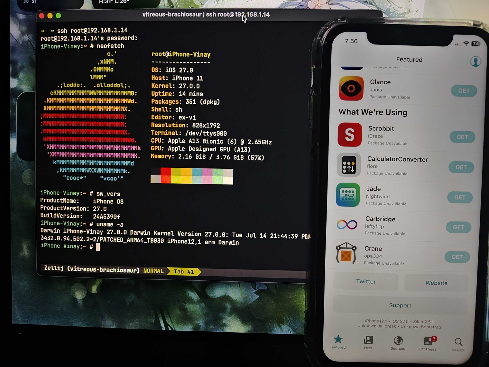

# Liter8

Patch, restore and boot custom iOS firmware on an iPhone 11 from macOS, using the usbliter8 exploit.

[](LICENSE)   



> [!WARNING]
> Liter8 is under active development. Support is exact-build and exact-device scoped; an unlisted IPSW or board is not implicitly compatible.
> This is a tethered jailbreak: the device boots only from pwn DFU with `fw boot`, so the host is needed every time.

## Tested on

| Firmware        | Build      | Device               |
| --------------- | ---------- | -------------------- |
| iOS 27.0 beta 4 | `24A5390f` | iPhone 11 · `n104ap` |
| iOS 27.0 RC     | `24A435`   | iPhone 11 · `n104ap` |
| iOS 27.0        | `24A437`   | iPhone 11 · `n104ap` |
| iOS 27.0.1      | `24A446`   | iPhone 11 · `n104ap` |
| iOS 27.2 beta 1 | `24B5084k` | iPhone 11 · `n104ap` |
| iOS 27.2 beta 2 | `24B5089g` | iPhone 11 · `n104ap` |

Every build listed is **end-to-end verified**: an erase restore, a normal boot and a repeat boot all passed on hardware.

> [!IMPORTANT]
> A build Apple no longer signs cannot be restored. `fw restore-cfw` captures a fresh APTicket from Apple's TSS during the restore, so once signing stops the build stays listed as tested but is no longer installable. Check signing status for your device before picking a build.

An unsupported IPSW fails before extraction. A recognized firmware profile never supplies patch offsets; offsets remain outputs of the resolvers.

## TODO

Known gaps. These need more research, and contributions are welcome.

- [ ] SEP
- [ ] Passcode
- [ ] Cellular
- [ ] Apple services
- [ ] Improve Tweak injection (works, but not as robust as vphone)
- [ ] iPhone 11 Pro and Pro Max support (i don't have device to verify)

Everything else works: normal boot to the home screen, root SSH, apt and Sileo, TrollStore, and apps launching.

## Install and build

Liter8 requires macOS 14 or newer, Xcode Command Line Tools with Swift 6, and Homebrew. Install the host dependencies:

```sh
brew install \
  sevenzip blacktop/tap/ipsw gnu-tar coreutils zstd autoconf automake libtool pkg-config \
  libimobiledevice libimobiledevice-glue libirecovery libusbmuxd libplist libtatsu libzip curl 
```

> [!NOTE]
> IPSW extraction uses `7zz` from the `sevenzip` formula, and Liter8 looks for it at `/opt/homebrew/bin/7zz`. On Intel Homebrew it lands in `/usr/local/bin`, so set `LITER8_7ZZ` to its path.

Clone, prepare the pinned tools, and build the release executable:

```sh
git clone --recurse-submodules https://github.com/Xplo8E/liter8.git
cd liter8
make setup
make release
```

The executable is `.build/release/liter8`. Device boot also requires the reviewed project-specific `irecovery`; pass its path with `--irecovery`.

## Usage

Keep every generated file under one work directory. `--work-dir` overrides `WORK_DIR`; without either, Liter8 uses the current directory.

> [!TIP]
> Run the steps in order, every time. Each one consumes the previous step's output, so a part-stale work directory is not a supported starting point. If you come back to a device later, start again from `fw make-cfw` rather than resuming halfway.

> [!CAUTION]
> Step 3 erases the device. `fw restore-cfw` performs an erase restore and destroys everything on it. There is no undo. Check the selected IPSW, device, build, board and work directory before running it.

### 1. Prepare the IPSW

```sh
export WORK_DIR="$PWD/.liter8"

.build/release/liter8 fw prepare --file /path/to/firmware.ipsw
```

`fw prepare` identifies the build from `BuildManifest.plist`; the IPSW filename is ignored. Set `IPSW_FILE` if you do not want to pass `--file`.

### 2. Build the CFW

```sh
.build/release/liter8 fw make-cfw
```

> [!IMPORTANT]
> `fw make-cfw`, `fw get-rd` and `fw get-boot` accept `--serial`, adding `serial=3` to the boot arguments of the artifact they build. Off by default: it moves the kernel console to the UART, and the device then shows no boot log on its own screen. The literal is fixed at build time, so pass it per artifact.

### 3. Restore the CFW

Put the device in pwn DFU, then run:

```sh
.build/release/liter8 fw restore-cfw
```

Liter8 verifies the CFW, manages the local TSS proxy, captures the restore-bound APTicket, and stops the proxy when `idevicerestore` exits.

### 4. Boot the SSH restore ramdisk

Return the device to pwn DFU:

```sh
.build/release/liter8 fw get-rd
.build/release/liter8 fw boot-rd --irecovery /path/to/custom/irecovery
```

The ticket captured by step 3 is now at `$WORK_DIR/apticket.im4m`, so `--ticket` is not needed here.

### 5. Provision the restored system

Run these while the device is in SSHRD:

```sh
.build/release/liter8 fw bootstrap --check
.build/release/liter8 fw bootstrap
.build/release/liter8 fw prepare-rootfs
.build/release/liter8 fw provision --check
.build/release/liter8 fw provision
.build/release/liter8 fw unmount-rootfs
```

### 6. Boot iOS

Return the device to pwn DFU:

```sh
.build/release/liter8 fw get-boot
.build/release/liter8 fw boot --irecovery /path/to/custom/irecovery
```

### 7. Finalize the bootstrap

After normal-boot SSH becomes available:

```sh
.build/release/liter8 fw finalize --check
.build/release/liter8 fw finalize
.build/release/liter8 fw finalize --check
```

## How Liter8 works

- Swift identifies firmware, parses binaries, resolves patch locations, validates pre-images, and handles IMG4, IM4P, APTickets, and DeviceTrees.
- Python coordinates macOS disk images, file staging, external tools, and device workflow steps. It contains no build-specific offset tables.
- Every patch plan resolves and validates completely before Liter8 writes an output.

```text
IPSW
  -> manifest and profile selection
  -> component extraction
  -> semantic resolution
  -> guarded patching
  -> IMG4/IM4P signing and verification
  -> CFW, SSHRD, or normal-boot artifacts
```

## Repository layout

```text
Sources/
  Liter8CLI/                 CLI parsing and workflow dispatch
  Liter8Core/
    Binary/                  ARM64, Mach-O and Objective-C analysis
    Firmware/                IPSW, IMG4/IM4P and runtime resources
    Patching/                patch records, manifests and guarded writes
    Profiles/                build-to-signature and payload selection
      Payloads/              the patch bytes each plan writes
    Resolvers/
      iBoot/                 iBSS, iBEC, boot arguments and display
      Kernel/                AMFI, AKS, SEP, sandbox and boot policy
      TXM/                   TXM restore and normal-boot policy
      Userland/              restore and post-boot binaries
      DeviceTree/            structural DeviceTree plans
Tests/Liter8CoreTests/       tests grouped by the same domains
fixtures/<build>/<board>/    exact-build verification manifests
scripts/                     generic host workflow orchestration
device/                      reviewed device provisioning resources
payloads/                    pinned SSHRD payload inputs
tools/                       reviewed or setup-built host tools
vendor/                      pinned source dependencies
docs/                        design notes and exact-device run evidence
```

This remains one `Liter8Core` Swift target. The folders express ownership without adding artificial target boundaries or widening internal APIs.

## Contributing

Read [docs/CONTRIBUTING.md](docs/CONTRIBUTING.md) first. Firmware ports also follow [docs/ADDING_FIRMWARE_SUPPORT.md](docs/ADDING_FIRMWARE_SUPPORT.md).

## Documentation

- [Architecture and onboarding](CODEBASE_GUIDE.md)
- [Firmware and device support guide](docs/FIRMWARE_SUPPORT_GUIDE.md)
- [iOS 27 `24A435` resolver and device evidence](docs/plans/IOS_27_24A435_RC_PATCHES.md)
- [iPhone 11 beta-4 device run](docs/runs/IOS_27_BETA4_IPHONE11.md)
- [Bootstrap and provisioning status](docs/design/BOOTSTRAP_JB_STATUS.md)
- [Normal boot handoff](docs/design/NORMAL_BOOT_HANDOFF.md)
- [Performance backlog](docs/BACKLOG.md)

> [!NOTE]
> `fw get-rd` and `fw get-boot` currently rebuild more artifacts than needed. Normal Apple pairing also remains separate from the verified Wi-Fi and Dropbear SSH path. Both items are tracked in the project documentation.

## Acknowledgements

Liter8 builds on research and tooling published by the following projects and contributors:

- [usbliter8-fun](https://github.com/wh1te4ever/usbliter8-fun) by [wh1te4ever](https://github.com/wh1te4ever), whose iOS 27 beta 2 and beta 3 CFW and ramdisk work formed the base of the iPhone 11 beta-4 port.
- [34306](https://github.com/34306/usbliter8-fun) (Huy Nguyen) for the fork, tutorial, and original `patches/` scripts used by the public workflow.
- [Procursus](https://github.com/ProcursusTeam) for the rootless bootstrap.
- [khanhduytran0](https://github.com/khanhduytran0) for the DeviceTree and kernel USB-restriction ideas.
- [tihmstar](https://github.com/tihmstar) for `img4` and `img4tool` and their APTicket-based IMG4 signing work.
- [m1stadev](https://github.com/m1stadev) and [doronz88](https://github.com/doronz88) for `pyimg4` and `pymobiledevice3`, used by the earlier kernelcache and USB forwarding flows.
- [Lakr233](https://github.com/Lakr233) for [vphone-cli](https://github.com/Lakr233/vphone-cli), whose Swift CLI, firmware workflow structure, and vendored IMG4 integration informed Liter8, and for `trollvnc` and USB device-control work.

## License

Liter8's original source is available under the [MIT License](LICENSE). Third-party submodules, tools, and payloads remain subject to their respective licenses and distribution terms.
